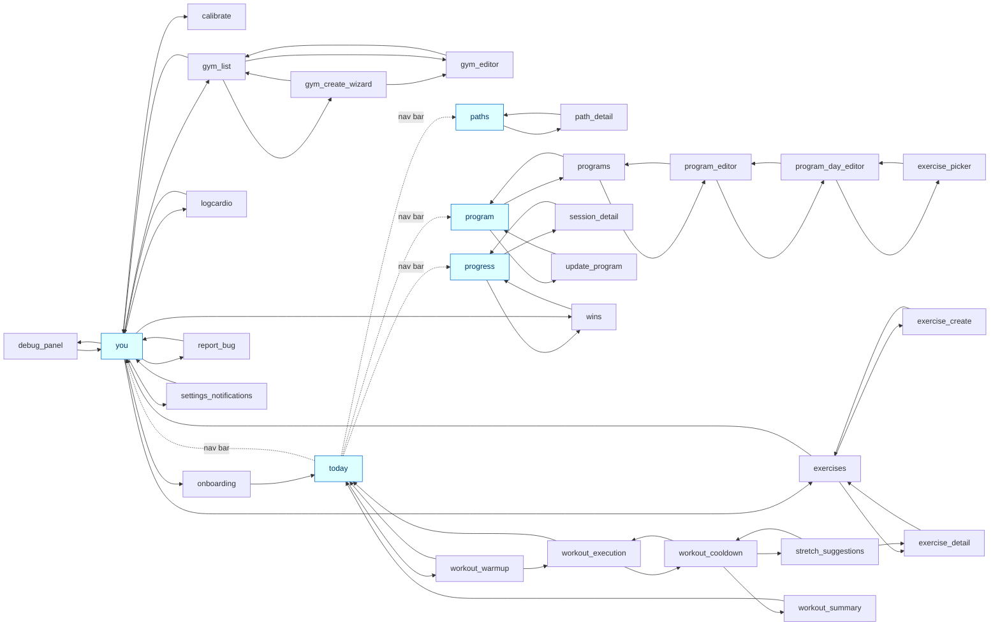

# PseudoCoup -- navigation map (static)

Screens are nodes; edges are `router.navigate()` calls found statically in
handler bodies. Red = NOT reachable from the entry screen by any nav path.

_The 5 blue tabs share a persistent bottom nav bar (dotted edges = that hub, which lives in the router, not in a screen)._

**All screens reachable from `today`.**
